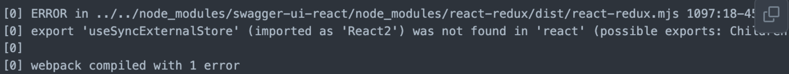

# [Backstage](https://backstage.io)

## Develop
### Environments
* #### Node
    ```
    v18.16.0
    ```
* #### NPM
    ```
    v9.5.1
    ```
* #### yarn
    ```
    v1.22.21
    ```
### How to Start
###### Before you start, make sure your node version is v18.16.0. You can use command below to switch version be using `nvm`
```sh
$ nvm use
```

```sh
$ yarn install
$ yarn dev
```
#### Trouble Shooting
* ##### Export `useSyncExternalStore` was not found in `react`
    `👎 If you get the bad feedback when you excute  yarn dev`

    
    ###### Solution:
    * ###### Open ` package.json ` file of the root path
      * 
    * ###### Re-install
        ```shell
        $ yarn install
        ```
    * ###### Repeat to verify that the problem is solved
        ```shell
        $ yarn dev
        ```
### Component
###### To view all the components you can import by following this [link](https://backstage.io/storybook/?path=/story/plugins-examples--plugin-with-data)

## Deploy
###### For a complete step-by-step guide, please refer to this [link](https://github.com/KevinShih-689/note/blob/main/learning-note/backstage/backstage.md#deploy).


